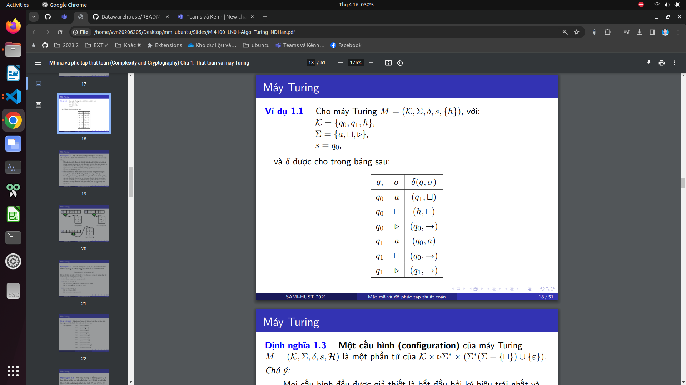
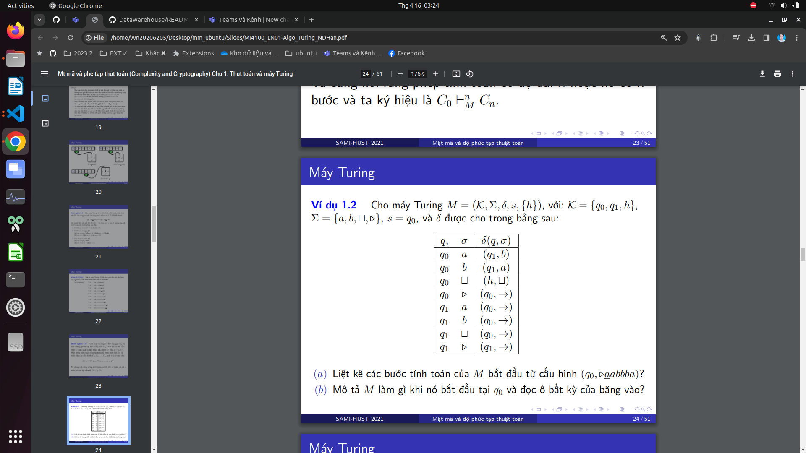
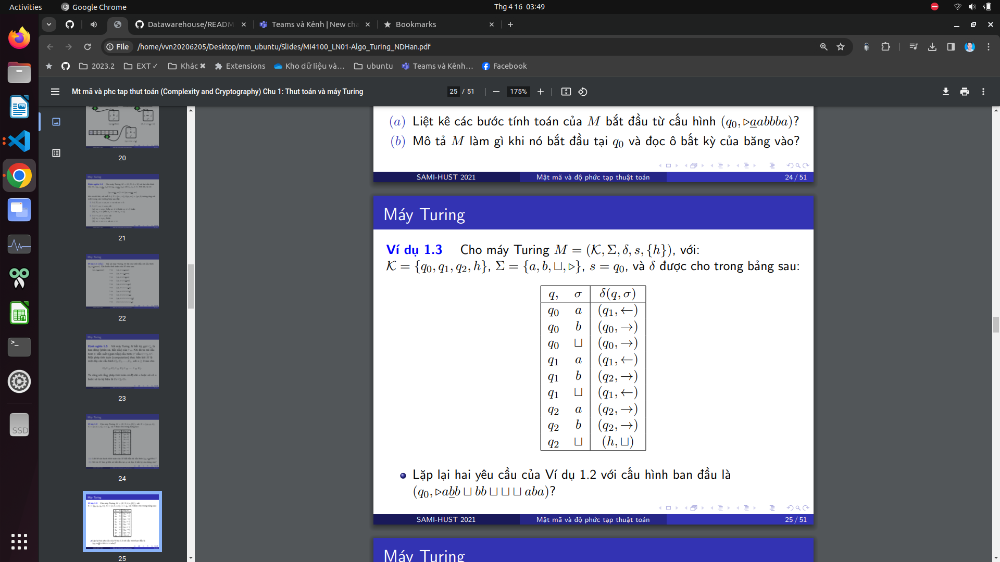

# 1: Bảng
Phai co      trái nhất: ▷
# 2:  DDồ thị chuyển
Phai co      2 vong tron ket thuc
Phai co dich chuyen trai: left
Phai co dich chuyen phai: right
# 3:Cac may tm
Phai co      yes: Cấu hình xxxxxxxxxx
Phai co      no: Cấu hình xxxxxxxxxx
# Kí tự
Kí tự khoảng trống: ⊔
Kí tự   trái nhất: ▷
Kí tự   xxxxxxxxxxxxxx: left
Kí tự   xxxxxxxxxxxxxx: right

# Ví dụ 1.1

# Ví dụ 1.2

# Ví dụ 1.3

# Bài tập 1.1 
Tìm dấu cách trong một xâu
# Bài tập 1.2
Xâu cân xứng
# Bài tập 1.3
So sanh hai số nhị phân

